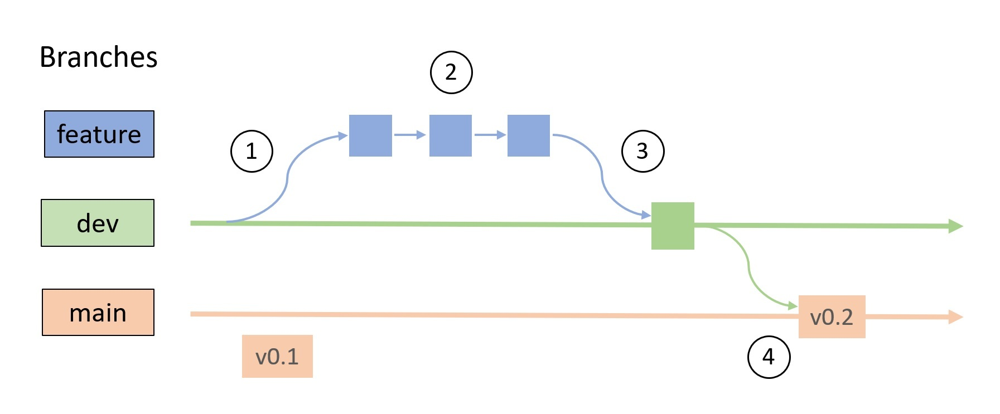

# Workflow




Use git flow: `main` branch is for releases, `development` for development, both should be stable (all tests must pass), but development branch gives an extra for fixing bugs.

1. Read [CaImAn CONTRIBUTING](https://github.com/flatironinstitute/CaImAn/blob/dev/CONTRIBUTING.md)
2. Create `development` branch.
3. Protect `main` and `development` branches so they can't be pushed to, see [docs](https://docs.github.com/en/repositories/configuring-branches-and-merges-in-your-repository/managing-protected-branches/managing-a-branch-protection-rule)

## General workflow:
- pick an issue or feature to develop and create a new branch off of `development`.
- when ready, open a pull request (to `development`) and address any issues that come up, including ensuring that tests pass
- merge into `development`.
- after enough time or enough changes, merge into `main` and make a release.

## Versioning

Releases should follow [semantic versioning](https://semver.org/) and deploy to `pypi` (and optionally `conda`), see the notes on [packaging](02-packaging.md) and [continuous integration](06-ci.md) for more. Semantic versioning means version try to use the following scheme:

```
Given a version number MAJOR.MINOR.PATCH, increment the:
  -  MAJOR version when you make incompatible API changes
  -  MINOR version when you add functionality in a backward compatible manner
  -  PATCH version when you make backward compatible bug fixes
```

In practice, it is hard to determine what a "breaking change" is. For example, is it considered a breaking change if you change a private method in a backwards-incompatible way? In python, users are not supposed to rely on methods that begin with an underscore, but if your package is large enough, someone almost certainly does ([relevant xkcd](https://xkcd.com/1172/)). Some developers have tried to address these concerns by focusing their versioning protocol on authorial intent, trying to avoid sounding like they're making guarantees about breaking changes (see the [INTERSECT packaging training](https://intersect-training.org/packaging/05-versioning/index.html#semver-semantic-versioning) for this protocol and more thoughts on this).

Regardless on what you decide, you should explain your scheme in your `CONTRIBUTING.md` file (see this repo's included file for an example).

## Decision-making / gate-keeping

- Every repo should have a [CODEOWNER](https://docs.github.com/en/repositories/managing-your-repositorys-settings-and-features/customizing-your-repository/about-code-owners) who must approve any PR before merge into `development` and `main`.
- Code owner can decide whether they want secondary approval from someone, which can be enforced by Github through branch protection rules.

## Resources:
- [scikit-learn contributing](https://scikit-learn.org/stable/developers/contributing.html)
- [matplotlib contributing](https://matplotlib.org/stable/devel/index.html)
- [GitKraken](https://www.gitkraken.com/learn/git/git-flow)
- [Gitlab complex image](https://docs.gitlab.com/ee/topics/img/gitlab_flow_gitdashflow.png)
